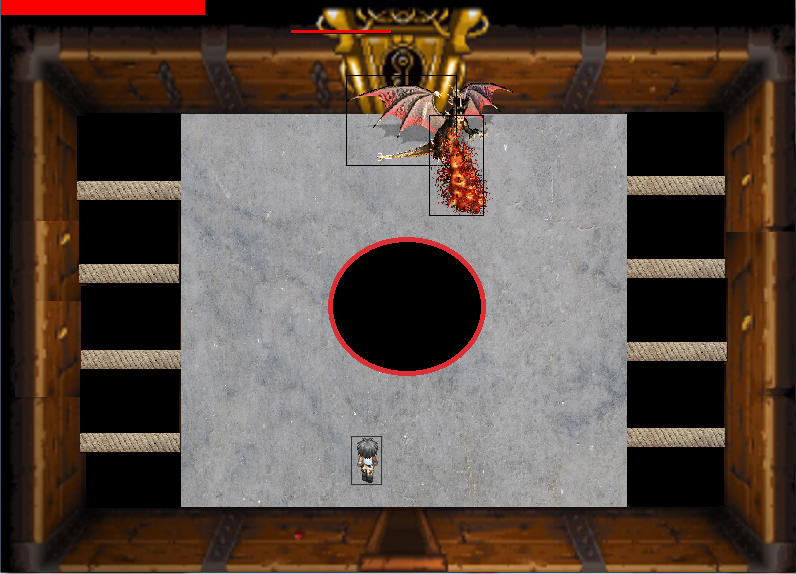

# Zyra-Quest

## Getting Started

You just have to run ZyraQuest.jar to play
 
## Control
- Use Arrow Keys to moove Zyra
- Use spacebar to shot, it is limited to 10 shot in the same time
- Walk on apple to heal yourself
- Before facing the boss you have a room where you can change the power of your attack by walking on the green sphere
- Watchout if you fall in hole, you will lose health
- To go to the next room you have to clear the room before accessing to the next room

## What I have done 

I realized this game alone and everything has been made by myself wich mean : 
- Management collision by creating some script in order to recreate the hitbox concept, hitbox are drawn in the game.
- Sprite animation : Not the best solution I imagined beacause it depend of the computer power but it should work on most computer. Furthermore it was my first game without using Game Engine and I did not have the time to resolve this issue.
- IA : 
     - Mage shot in your direction if you are in range, they do not move
     - Dragon : It can move to right or left, after moving he shot a fire to you. There is no pattern because it use some random to make it more difficult to beat. When he become low life, his speed increase.
- Aim Algorithm : 
     -To shot on the player I imagined an algorithm using slope between the player and the ennemy which is shooting to the player.
- Generic : I made a huge work to make most possible algorithm generic in order to add new item/ennemie/room etc.. very easily

## Conclusion
There is not a lot of room because i had to meet the deadline of my course but I made a good work to make the game the most generic possible so it is very easy to add new content.
## Authors

* **Sacha Vanleene** 
